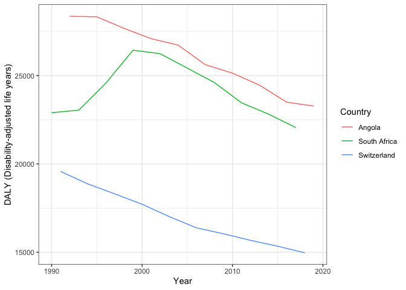

Global Disease Burden Analysis
================
mhseb2, Martial, joeluzh

# Introduction

This document compares the Disability-Adjusted Life Year (DALY) diseases
burden for three countries: Angola, South Africa, and Switzerland. We
compare the burden due to communicable, maternal, neonatal, and
nutritional diseases (CMNN), non-communicable diseases (NCDs), and
overall disease burden for these countries.

The source data is from the Institute for Health Metrics and Evaluation
(IHME) Global Burden of Disease (GBD) study.

# Communicable, Maternal, Neonatal, and Nutritional Disease Burden (CMNN)

## Table of Estimates for CMNN Burden Over Time

| Entity       | Code |      1990 |      1991 |      1992 |      1993 |     1994 |      1995 |      1996 |      1997 |      1998 |      1999 |      2000 |      2001 |      2002 |      2003 |      2004 |      2005 |      2006 |      2007 |      2008 |      2009 |      2010 |      2011 |      2012 |      2013 |      2014 |      2015 |      2016 |       2017 |       2018 |       2019 |
|:-------------|:-----|----------:|----------:|----------:|----------:|---------:|----------:|----------:|----------:|----------:|----------:|----------:|----------:|----------:|----------:|----------:|----------:|----------:|----------:|----------:|----------:|----------:|----------:|----------:|----------:|----------:|----------:|----------:|-----------:|-----------:|-----------:|
| Angola       | AGO  | 60834.031 | 59947.455 | 58790.541 | 58131.635 | 57449.72 | 56765.547 | 56124.057 | 55033.191 | 53145.024 | 51554.027 | 50329.267 | 48792.860 | 46979.301 | 45261.276 | 43447.860 | 41554.966 | 39911.406 | 37318.364 | 35110.981 | 33209.457 | 31372.284 | 29892.177 | 28580.453 | 27260.902 | 25792.085 | 24752.865 | 24262.379 | 23424.5056 | 22531.0654 | 21500.3346 |
| South Africa | ZAF  | 21011.637 | 20646.687 | 20961.172 | 20733.489 | 21688.30 | 22983.167 | 25080.303 | 28394.878 | 32079.649 | 35567.267 | 39770.058 | 43351.419 | 47021.063 | 50314.473 | 52677.092 | 53721.193 | 53340.403 | 51198.477 | 48249.601 | 44284.143 | 40551.601 | 36923.923 | 33496.079 | 30854.987 | 29399.008 | 28383.468 | 27854.706 | 26968.9402 | 24952.8804 | 23778.3720 |
| Switzerland  | CHE  |  1499.979 |  1455.393 |  1417.306 |  1356.123 |  1304.42 |  1558.675 |  1465.518 |  1372.031 |  1313.203 |  1286.823 |  1282.421 |  1255.962 |  1215.333 |  1183.923 |  1171.434 |  1143.556 |  1143.139 |  1110.104 |  1094.406 |  1103.403 |  1069.519 |  1052.946 |  1041.522 |  1041.797 |  1036.248 |  1039.102 |  1005.316 |   993.0077 |   981.4799 |   972.5998 |

DALY burden over time for South Africa, Switzerland and Angola

## Plot Showing Trends in CMNN Burden Over Time

## Summary of CMNN Burden Findings

Provide a brief analysis based on the data presented in the table and
chart. Highlight any significant findings or patterns. About 3
sentences.

# Non-Communicable Disease Burden (NCD)

## Table of Estimates for NCD Burden Over Time

| Year |   Angola | South Africa | Switzerland |
|-----:|---------:|-------------:|------------:|
| 1990 |       NA |     22903.42 |          NA |
| 1991 |       NA |           NA |    19573.97 |
| 1992 | 28364.95 |           NA |          NA |
| 1993 |       NA |     23047.14 |          NA |
| 1994 |       NA |           NA |    18870.66 |
| 1995 | 28331.60 |           NA |          NA |
| 1996 |       NA |     24580.75 |          NA |
| 1997 |       NA |           NA |    18303.29 |
| 1998 | 27680.99 |           NA |          NA |
| 1999 |       NA |     26441.48 |          NA |
| 2000 |       NA |           NA |    17717.36 |
| 2001 | 27098.17 |           NA |          NA |
| 2002 |       NA |     26243.70 |          NA |
| 2003 |       NA |           NA |    17020.54 |
| 2004 | 26728.08 |           NA |          NA |
| 2005 |       NA |     25428.15 |          NA |
| 2006 |       NA |           NA |    16385.49 |
| 2007 | 25621.76 |           NA |          NA |
| 2008 |       NA |     24610.46 |          NA |
| 2009 |       NA |           NA |    16046.18 |
| 2010 | 25141.99 |           NA |          NA |
| 2011 |       NA |     23461.90 |          NA |
| 2012 |       NA |           NA |    15672.35 |
| 2013 | 24458.84 |           NA |          NA |
| 2014 |       NA |     22819.93 |          NA |
| 2015 |       NA |           NA |    15340.48 |
| 2016 | 23497.23 |           NA |          NA |
| 2017 |       NA |     22060.71 |          NA |
| 2018 |       NA |           NA |    14967.97 |
| 2019 | 23277.68 |           NA |          NA |

## Plot Showing Trends in NCD Burden Over Time

<!-- -->

## Summary of NCD Burden Findings

From 1990 to 2019, Angola shows consistently higher DALY rates for
non-communicable diseases compared to South Africa and Switzerland, with
a gradual decline over the years. South Africa experiences fluctuations
in DALYs, peaking in the late 1990s before gradually declining, while
Switzerland consistently has the lowest DALY burden, reflecting a
relatively lower impact of non-communicable diseases. Overall, all three
countries show a general downward trend in the burden of
non-communicable diseases over time.

# Overall Disease Burden

## Table of Estimates for Overall Disease Burden Over Time

## Plot Showing Trends in Overall Disease Burden Over Time

## Summary of Overall Disease Burden Findings

Provide a brief analysis based on the data presented in the table and
chart. Highlight any significant findings or patterns. About 3
sentences.
